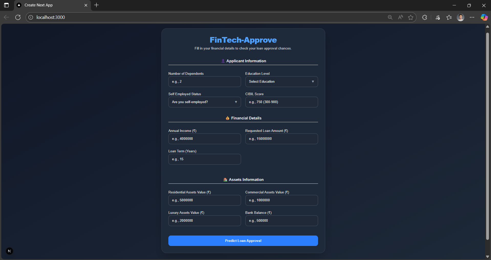
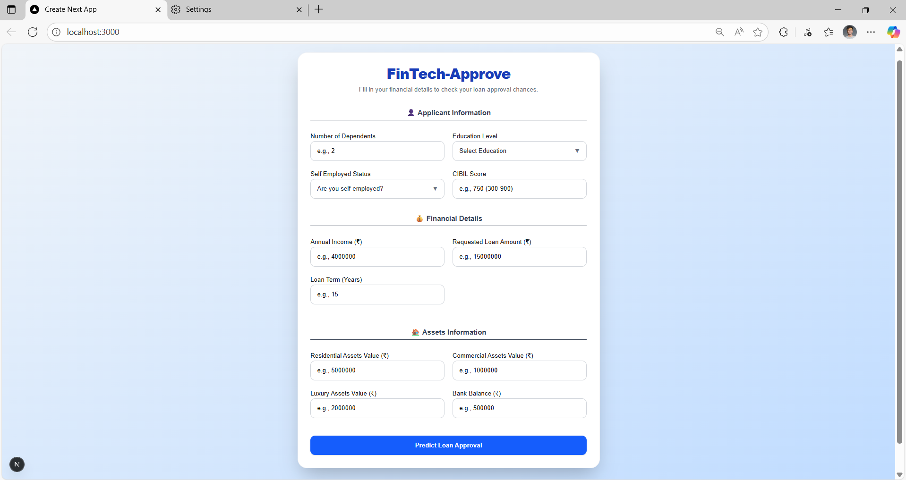
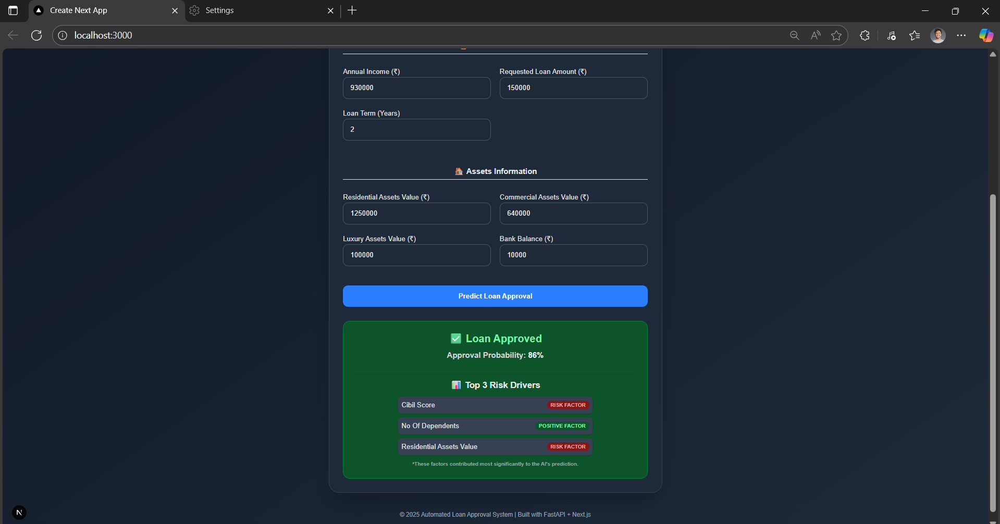

# FinTech-Approve: Automated Loan Approval System

An intelligent loan approval prediction system using machine learning and explainable AI (SHAP) to make data-driven lending decisions.

## 🚀 Project Overview

**FinTech-Approve** is an end-to-end automated loan approval system that:
- Predicts loan approval probability using a trained machine learning model
- Provides explainable AI insights showing which factors drive the decision
- Maintains an audit trail of all decisions for compliance
- Features a modern Next.js frontend with a FastAPI backend

---

## 📋 Prerequisites

- **Python 3.8+** (with pip)
- **Node.js 16+** (with npm)
- **Windows PowerShell / CMD** or **macOS/Linux Terminal**

---

## 🔧 Setup & Installation

### Backend Setup (Python)

#### Step 1: Navigate to backend folder
```bash
cd path\to\your\project\backend
```

#### Step 2: Create a virtual environment
```bash
python -m venv .venv
```

#### Step 3: Activate the virtual environment

**Windows PowerShell:**
```powershell
.\.venv\Scripts\Activate.ps1
```

*If PowerShell blocks execution, run this once:*
```powershell
Set-ExecutionPolicy -ExecutionPolicy RemoteSigned -Scope CurrentUser
```

**Windows CMD:**
```cmd
.\.venv\Scripts\activate.bat
```

**macOS/Linux:**
```bash
source .venv/bin/activate
```

#### Step 4: Install Python dependencies
```bash
pip install -r requirements.txt
```

#### Step 5: Start the backend server
```bash
uvicorn app:app --reload
```

✅ Backend runs at: **http://127.0.0.1:8000**  
📖 Interactive API docs: **http://127.0.0.1:8000/docs**

---

### Frontend Setup (Node.js)
*In seperate terminal*

#### Step 1: Navigate to frontend folder (in a new terminal)
```bash
cd path\to\your\project\frontend
```

#### Step 2: Install dependencies and start dev server
```bash
npm install
npm run dev
```

✅ Frontend runs at: **http://127.0.0.1:3000**

---

## 🎯 How to Use

1. **Start Backend** → Terminal 1: `uvicorn app:app --reload`
2. **Start Frontend** → Terminal 2: `npm run dev`
3. **Open Browser** → Visit `http://localhost:3000`
4. **Enter Loan Details** → Fill in applicant information
5. **View Results** → See approval decision with risk driver explanations

---

## 📊 Project Structure

```
Automated_loan_approval_system/
├── backend/
│   ├── app.py                      # FastAPI application
│   ├── model.joblib                # Pre-trained ML model
│   ├── data_prep_and_train.py      # Model training script
│   ├── check_audit.py              # Audit trail viewer
│   ├── requirements.txt            # Python dependencies
│   └── audit.db                    # Decision audit database
├── frontend/
│   ├── app/
│   │   ├── page.tsx                # Main application page
│   │   └── layout.tsx              # Layout component
│   └── package.json                # Node dependencies
├── docker-compose.yml              # Docker orchestration
└── readme.md                        # This file
```

---

## 🔐 API Endpoints

### Health Check
```
GET /
```
Response: `{"message": "FinTech-Approve API is running. Model ready."}`

### Loan Prediction
```
POST /predict
```

**Request Body:**
```json
{
  "no_of_dependents": 2,
  "education": "Graduate",
  "self_employed": "No",
  "income_annum": 500000,
  "loan_amount": 1000000,
  "loan_term": 12,
  "cibil_score": 750,
  "residential_assets_value": 5000000,
  "commercial_assets_value": 0,
  "luxury_assets_value": 100000,
  "bank_asset_value": 50000
}
```

**Response:**
```json
{
  "loan_approval": "Approved",
  "approval_probability": 0.85,
  "risk_drivers": [
    {
      "feature": "CIBIL Score",
      "contribution_score": 0.35,
      "effect": "Support Approval"
    },
    {
      "feature": "Income Annum",
      "contribution_score": 0.28,
      "effect": "Support Approval"
    }
  ]
}
```

---

## 🖼️ Screenshots & Visuals

**Data Analysis & Visualizations:**


**User Interface:**



**Application Interface:**


**Prediction Results:**


---

## 🐳 Docker Deployment (Optional)

Build and run with Docker:
```bash
docker-compose up --build
```

---

## ⚠️ Troubleshooting

| Issue | Solution |
|-------|----------|
| PowerShell blocks activation script | Run: `Set-ExecutionPolicy -ExecutionPolicy RemoteSigned -Scope CurrentUser` |
| Port 8000 already in use | Run: `uvicorn app:app --reload --port 8001` |
| Port 3000 already in use | Run: `npm run dev -- -p 3001` |
| scikit-learn version warnings | Safe to ignore; model still works correctly |
| SHAP initialization error | Model loads; explanations may be unavailable |

---

## 📝 Key Features

✨ **Machine Learning Predictions** - Pre-trained decision tree model  
🔍 **Explainable AI (SHAP)** - Understand why decisions are made  
📊 **Audit Trail** - SQLite database logs all decisions for compliance  
🔐 **CORS Enabled** - Frontend-backend communication secured  
📱 **Responsive UI** - Modern Next.js frontend  
🚀 **Fast API** - FastAPI with automatic documentation

---

## 🛠️ Technology Stack

- **Backend:** FastAPI, scikit-learn, SHAP, SQLite
- **Frontend:** Next.js, TypeScript, React
- **ML Model:** Random Forest Classifier + Decision Tree
- **Database:** SQLite (audit logging)
- **Deployment:** Docker & Docker Compose


#test
---

## 📄 License

This project is provided as-is for educational and commercial use.
