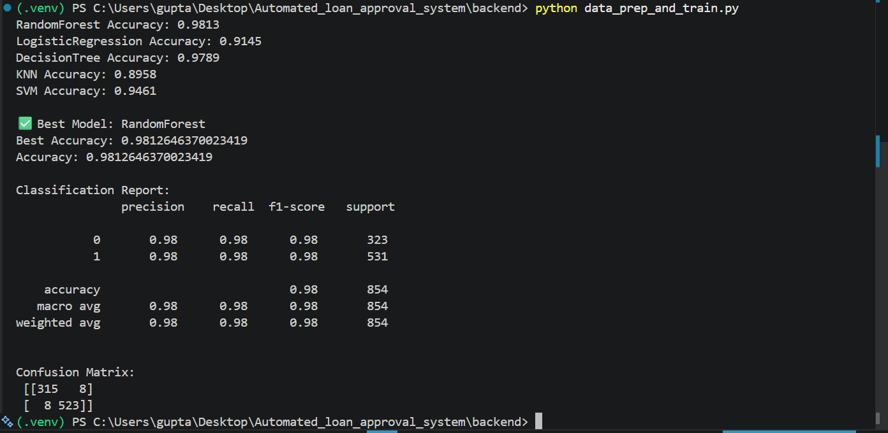
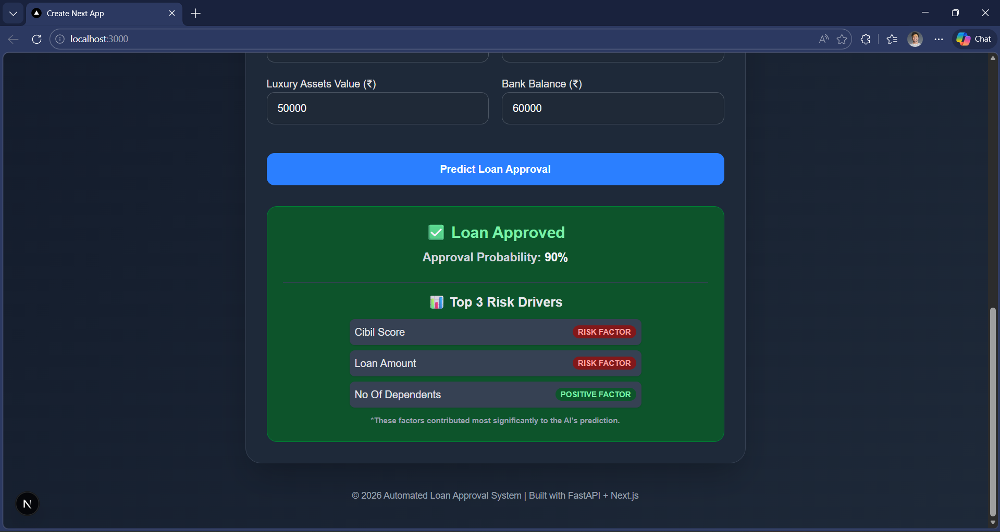
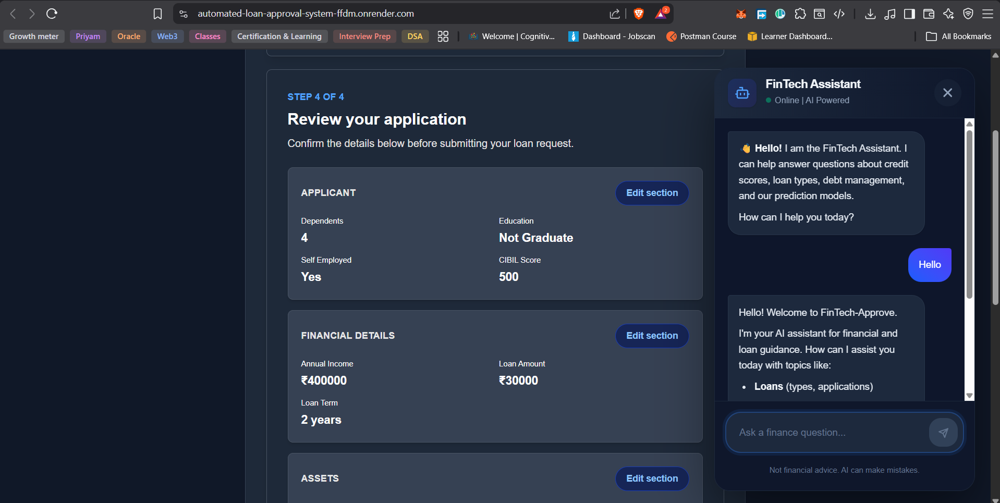

# FinTech-Approve: Automated Loan Approval System

**🔴 Live Application:** [https://automated-loan-approval-system-ffdm.onrender.com](https://automated-loan-approval-system-ffdm.onrender.com)

An intelligent loan approval prediction system using machine learning and explainable AI (SHAP) to make data-driven lending decisions.

## 🚀 Project Overview

**FinTech-Approve** is an end-to-end automated loan approval system that:
- Predicts loan approval probability using a trained machine learning model
- Provides explainable AI insights showing which factors drive the decision
- Maintains an audit trail of all decisions in a Supabase PostgreSQL database for compliance
- Features a unified deployment where a FastAPI backend serves a statically exported Next.js frontend

---

## Prerequisites

- **Python 3.10+** (with pip)
- **Node.js 18+** (with npm)
- **Windows PowerShell / CMD** or **macOS/Linux Terminal**

---

## Quick Dependency Installer (Recommended)

Use the setup scripts as an **AIO installer**. They can auto-download and install missing prerequisites from the internet (Python, Node.js, Docker/Compose) using your OS package manager, then continue project setup.

### Which script should you run?

| Your OS | Exact command to run | Best for |
|---|---|---|
| Windows (PowerShell/CMD, **Run as Administrator**) | `setup.bat all` | Full one-shot setup (local + Docker) |
| macOS/Linux | `chmod +x setup.sh && ./setup.sh all` | Full one-shot setup (local + Docker) |

### Windows commands
```cmd
setup.bat local
setup.bat docker
setup.bat all
setup.bat all --no-auto-install
```
Run `setup.bat` as **Administrator** only.
If `winget`, `choco`, and `scoop` are all missing, `setup.bat` will attempt to bootstrap Chocolatey and Scoop automatically.

### macOS/Linux commands
```bash
chmod +x setup.sh
./setup.sh local
./setup.sh docker
./setup.sh all
./setup.sh all --no-auto-install
```

### What each mode does

| Mode | What it does | When to use |
|---|---|---|
| `local` | Installs Python venv, backend dependencies, frontend dependencies, and prepares local run | You only want local development |
| `docker` | Installs/checks Docker + Compose and builds the project image | You only want containerized run |
| `all` | Runs both `local` and `docker` | Recommended for most users |
| `--no-auto-install` | Disables internet-based prerequisite installation | Use if Python/Node/Docker are already installed and pinned |

> If `backend/.env` is missing, the scripts create a template automatically.

---

## Setup & Installation (Manual)

### Backend Setup (Python)

#### Step 1: Navigate to backend folder
```bash
cd path\to\your\project\backend
```

#### Step 2: Create a virtual environment
```bash
python -m venv .venv
```

#### Step 3: Activate the virtual environment

**Windows PowerShell:**
```powershell
.\.venv\Scripts\Activate.ps1
```

*If PowerShell blocks execution, run this once:*
```powershell
Set-ExecutionPolicy -ExecutionPolicy RemoteSigned -Scope CurrentUser
```

**Windows CMD:**
```cmd
.\.venv\Scripts\activate.bat
```

**macOS/Linux:**
```bash
source .venv/bin/activate
```

#### Step 4: Configure Environment Variables
Create a `.env` file in the `backend/` directory with your Supabase credentials:
```env
SUPABASE_URL="your_supabase_project_url"
SUPABASE_KEY="your_supabase_anon_key"
GEMINI_API_KEY="your_gemini_api_key"
```

Create a `.env` file in the `frontend/` directory with your Supabase credentials:
```env
NEXT_PUBLIC_API_URL=http://localhost:8000
```

#### Step 5: Install Python dependencies
```bash
pip install -r requirements.txt
```

#### Step 6: Start the backend server
```bash
uvicorn app:app --reload
```

✅ Backend runs at: **http://127.0.0.1:8000**  
📖 Interactive API docs: **http://127.0.0.1:8000/docs**

---

### Frontend Setup (Node.js)
*In seperate terminal*

#### Step 1: Navigate to frontend folder (in a new terminal)
```bash
cd path\to\your\project\frontend
```

#### Step 2: Install dependencies and start dev server
```bash
npm install
npm run dev
```

✅ Frontend runs at: **http://127.0.0.1:3000**

---

## 🎯 How to Use

1. **Start Backend** → Terminal 1: `uvicorn app:app --reload`
2. **Start Frontend** → Terminal 2: `npm run dev`
3. **Open Browser** → Visit `http://localhost:3000`
4. **Enter Loan Details** → Fill in applicant information
5. **View Results** → See approval decision with risk driver explanations

---

## 📊 Project Structure

```
Automated_loan_approval_system/
├── backend/
│   ├── app.py                      # FastAPI application
│   ├── model.joblib                # Pre-trained ML model
│   ├── data_prep_and_train.py      # Model training script
│   ├── check_audit.py              # Audit trail viewer
│   ├── requirements.txt            # Python dependencies
│   └── .env                        # Environment variables (Supabase)
├── frontend/
│   ├── app/
│   │   ├── page.tsx                # Main application page
│   │   └── layout.tsx              # Layout component
│   └── package.json                # Node dependencies
├── docker-compose.yml              # Docker orchestration
└── readme.md                        # This file
```

---

## 🔐 API Endpoints

### Health Check
```
GET /
```
Response: `{"message": "FinTech-Approve API is running. Model ready."}`

### Loan Prediction
```
POST /predict
```

**Request Body:**
```json
{
  "no_of_dependents": 2,
  "education": "Graduate",
  "self_employed": "No",
  "income_annum": 500000,
  "loan_amount": 1000000,
  "loan_term": 12,
  "cibil_score": 750,
  "residential_assets_value": 5000000,
  "commercial_assets_value": 0,
  "luxury_assets_value": 100000,
  "bank_asset_value": 50000
}
```

**Response:**
```json
{
  "loan_approval": "Approved",
  "approval_probability": 0.85,
  "risk_drivers": [
    {
      "feature": "CIBIL Score",
      "contribution_score": 0.35,
      "effect": "Support Approval"
    },
    {
      "feature": "Income Annum",
      "contribution_score": 0.28,
      "effect": "Support Approval"
    }
  ]
}
```

---

## 🖼️ Screenshots & Visuals

**Data Analysis & Visualizations:**


**Dataset:**


**User Interface:**


**Prediction Results:**


**Chatbot:**


**Docker Deployment View:**


---

## 🚀 Running the Application

### 1. Local Development (Separate Terminals)
Run this if you want to make changes and see them instantly.

**Backend:**
```bash
cd backend
# Create & activate venv as shown in Prerequisites
.venv\Scripts\activate
pip install -r requirements.txt
uvicorn app:app --reload
```

**Frontend:**
```bash
cd frontend
npm install
npm run dev
```
Visit: `http://localhost:3000`

---

### 2. Docker Deployment (Single Command)
Run this for a production-like environment using the consolidated Dockerfile.

```bash
docker compose up --build
```
Visit: `http://localhost:8000` (Both frontend and backend)

---

### 3. Run from Docker Hub Image (Pre-built)
Skip building locally and run the pre-built image directly from Docker Hub.

**Prerequisites:**
- Docker Desktop installed and running
- `.env` file in `backend/` directory with your Supabase credentials

**Steps:**
1. **Pull the image:**
```bash
docker pull sudhanshugupta26/automated_loan_approval_system-app:06
```

2. **Run the container:**
```bash
docker run -d --name fintech_app -p 8000:8000 --env-file ./backend/.env sudhanshugupta26/automated_loan_approval_system-app:06
```

3. **Visit the application:**
   - Open `http://localhost:8000` in your browser

**Alternative: Using docker-compose with pre-built image**
Create a `docker-compose.hub.yml` file:
```yaml
services:
  app:
    image: sudhanshugupta26/automated_loan_approval_system-app:06
    ports:
      - "8000:8000"
    env_file:
      - ./backend/.env
    restart: always
```

Then run:
```bash
docker compose -f docker-compose.hub.yml up -d
```

**Stop the container:**
```bash
docker stop fintech_app
docker rm fintech_app
```

---

#### Docker in WSL (Windows Users)
If you are using **WSL** with **Docker Desktop**:

1. Ensure **Docker Desktop** is running.
2. Go to **Settings > Resources > WSL Integration**.
3. Enable integration for your specific WSL distribution (e.g., Ubuntu).
4. In your WSL terminal, run:
```bash
docker compose up --build
```
Visit: `http://localhost:8000`

---

## ⚠️ Troubleshooting

| Issue | Solution |
|-------|----------|
| PowerShell blocks activation script | Run: `Set-ExecutionPolicy -ExecutionPolicy RemoteSigned -Scope CurrentUser` |
| Port 8000 already in use | Run: `uvicorn app:app --reload --port 8001` |
| Port 3000 already in use | Run: `npm run dev -- -p 3001` |
| scikit-learn version warnings | Safe to ignore; model still works correctly |
| SHAP initialization error | Model loads; explanations may be unavailable |
| Docker error: "unable to get image" or "dockerDesktopLinuxEngine pipe not found" | **Docker Desktop is not running.** On Windows: Open Docker Desktop application from Start Menu or launch it with `& "C:\Program Files\Docker\Docker\Docker Desktop.exe"`. Wait 30-60 seconds for it to fully initialize, then retry `docker compose up`. |
| Docker build fails with npm errors | Ensure `frontend/package-lock.json` exists. Run `cd frontend && npm install` locally first, then retry `docker compose up --build`. |
| Docker container exits immediately | Check logs: `docker logs fintech_app`. If model training fails, verify `backend/loan_approval_dataset.csv` exists in the backend folder. |

---

## 📝 Key Features

✨ **Machine Learning Predictions** - Pre-trained decision tree model  
🔍 **Explainable AI (SHAP)** - Understand why decisions are made  
📊 **Audit Trail** - Supabase PostgreSQL securely logs all decisions for compliance  
🔐 **CORS Enabled** - Frontend-backend communication secured  
📱 **Responsive UI** - Modern Next.js frontend  
🚀 **Fast API** - FastAPI with automatic documentation  
💬 **Chatbot** - Integrated AI assistant to help answer queries

---

## 🛠️ Technology Stack

- **Backend:** FastAPI, scikit-learn, SHAP
- **Frontend:** Next.js, TypeScript, React
- **ML Model:** Random Forest Classifier + Decision Tree
- **Database:** Supabase PostgreSQL (audit logging)
- **Deployment:** Docker & Docker Compose

---

## 📄 License

This MIT licensed project is provided as-is for educational and commercial use.
